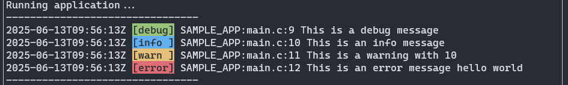

# Sample C Structured Logging

This Project represents an example for structured logging from a C project.  

## Building / Running

Make sure, you have Rust and CMake installed with an appropriate C compiler.
For the example below, run
```bash
./run.sh
```

This will:
* Build the Rust Project
* Copy the library to the C Project
* Build the C Project in `/tmp/log_test`
* Run the built `log_test` binary

## How it works

From the C perspective, the LOG statements can be used like printf:
```C
#include "log.h"

int main(int argc, char *argv[])
{
    setup_logging(LOG_LEVEL_DEBUG, "SAMPLE_APP");

    LOG_DEBUG("This is a debug message");
    LOG_INFO("This is an info message");
    LOG_WARN("This is a warning with %d", 10);
    LOG_ERROR("This is an error message %s", "hello world");

    return 0;
}
```
In reality, the preprocessor macros enrich the log statements with the correct log-level, the filename and the line-number.  
The message is printed into a buffer and sent to the Rust side.



The Rust side receives the log message and enriches it with:
- Timestamp
- Project name
- Log level
- File name
- Line number
- Message

The log message is then formatted and printed to stdout. Optionally, Rust can also write log statement as JSON to some other backend. This makes it easy to parse and process the logs with tools like `jq` or send them to a log aggregation service.

Example output:
```
{"file":"/home/stefanst/repo/rust-testing/structured_logging/c_proj/src/main.c","level":"debug","lineno":9,"message":"This is a debug message","project_name":"SAMPLE_APP","timestamp":"2025-06-13T09:57:49Z"}
{"file":"/home/stefanst/repo/rust-testing/structured_logging/c_proj/src/main.c","level":"info","lineno":10,"message":"This is an info message","project_name":"SAMPLE_APP","timestamp":"2025-06-13T09:57:49Z"}
{"file":"/home/stefanst/repo/rust-testing/structured_logging/c_proj/src/main.c","level":"warn","lineno":11,"message":"This is a warning with 10","project_name":"SAMPLE_APP","timestamp":"2025-06-13T09:57:49Z"}
{"file":"/home/stefanst/repo/rust-testing/structured_logging/c_proj/src/main.c","level":"error","lineno":12,"message":"This is an error message hello world","project_name":"SAMPLE_APP","timestamp":"2025-06-13T09:57:49Z"}
```
